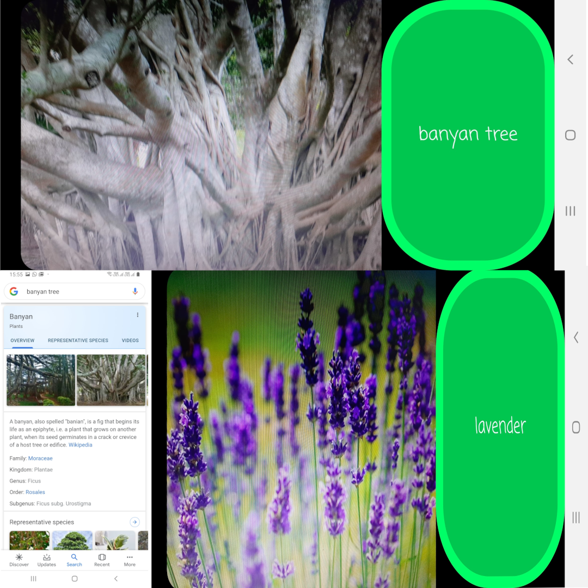

---
#### This is the reader's manual for using and editing this software project as you may like!
---

 

# About the Project

## I-Plantify

**Your Personal Plant Encylopedia**

Made possible using TensorFlow Lite (tm) and Android platform, this is a mobile application based project that uses Image Classification using Neural Networks to classify different trees and flowers. The images are captured in realtime using the phone's hardware camera and the related information is displayed using Google's Web-Search API.

Current database supports the following classes :

-   **Flowers** :

    1. Sunflower
    2. Daisy
    3. Rose
    4. Lily
    5. Lotus
    6. Jasmine
    7. Iris
    8. Dahlia
    9. Daffodil
    10. Lavender
    11. Marigold

-   **Trees** :
    1. Neem
    2. Apple
    3. Amla
    4. Peepal
    5. Banyan
    6. Aloe vera
    7. Cactus
    8. Banana
    9. Coconut

---

## Prerequisites for developing this software :

-   **For Data Training Purpose** :

    -   Python 3.x environment should be setup
    -   Compatible Tensorflow installation with the required supporting libraries should be installed. GPU Version is recommend if you have a newer NVIDIA GPU that supports CUDA Toolkit.
    -   PIL Library for Dataset Creation Script

-   **For Android Application Development** :
    -   Android Studio should be setup with the compatible JDK Environment.
    -   A virtual Android Emulation device or an Android Phone for testing your builds (recommended due to dynamic nature of the application).

---

## Installation Instructions for the End Users:

1. Compile the Applicaton using Android Studio for the Android SDK Version of your choice.
2. Use the generated build to test the application with the current dataset on your target device.

---

## Important Instructions for the Developers:

-   `retrain.py` is the file provided by Tensorflow Dev Team for performing Transfer Learning Based on your dataset. It can be invoked with the appropriate command line arguments to perform learning on your own dataset (images stored in folders [with the name of their class] in one parent folder containing all the class folders).

-   `convert_lite.py` is used to convert the tensorflow graph to tensorflow lite equivalent model stored in the same folder as the script file.

-   `rotate_img2.py` is used to produce 90 degree left and right rotated copies of the image files stored in the script directory using single invocation.

-   **Inception v3 (iNaturalist Dataset)** image classification neural network has been used to train the currently used graph file. You can use different models to obtain personalised results.

-   The Tensorflow Lite models and label file are stored in the **assets** folder and can be replaced by the developer with their own file.

-   Android image classifier can be modified to work according to the dev's requirements by modifying `ImageClassifier.java` file in the Android Application directory

---

## Application Screenshots

---

Feel free to try out my project, make your own implementations, suggest changes and modification and help in improving my project. :)

---

**P.S.** : _Hail the internet for all the awesome resources and information present on anything you want to learn. My whole hearted gratitude to everybody who made it possible for me to complete this project of mine._ :)

---
